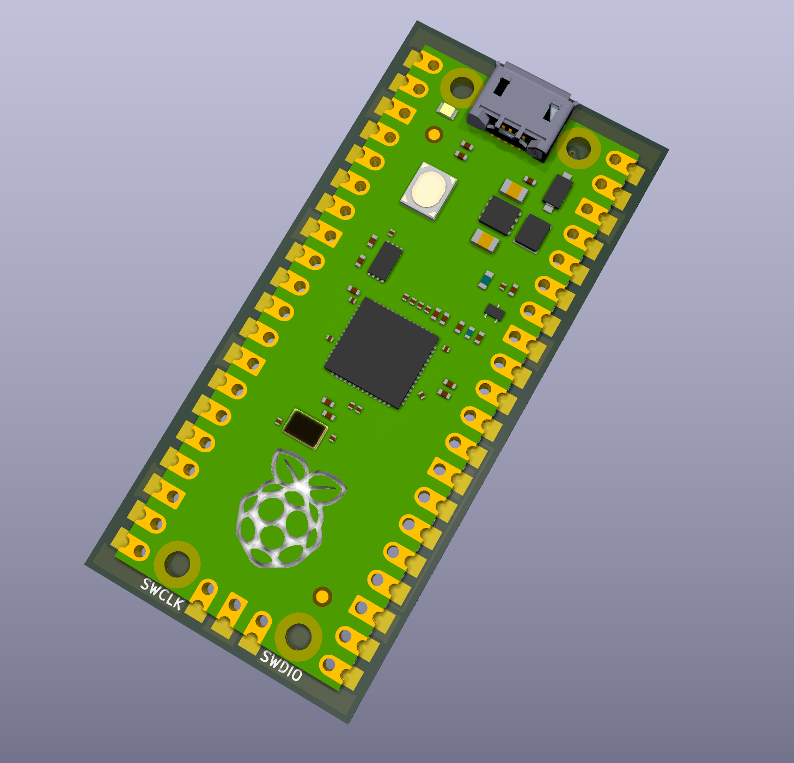
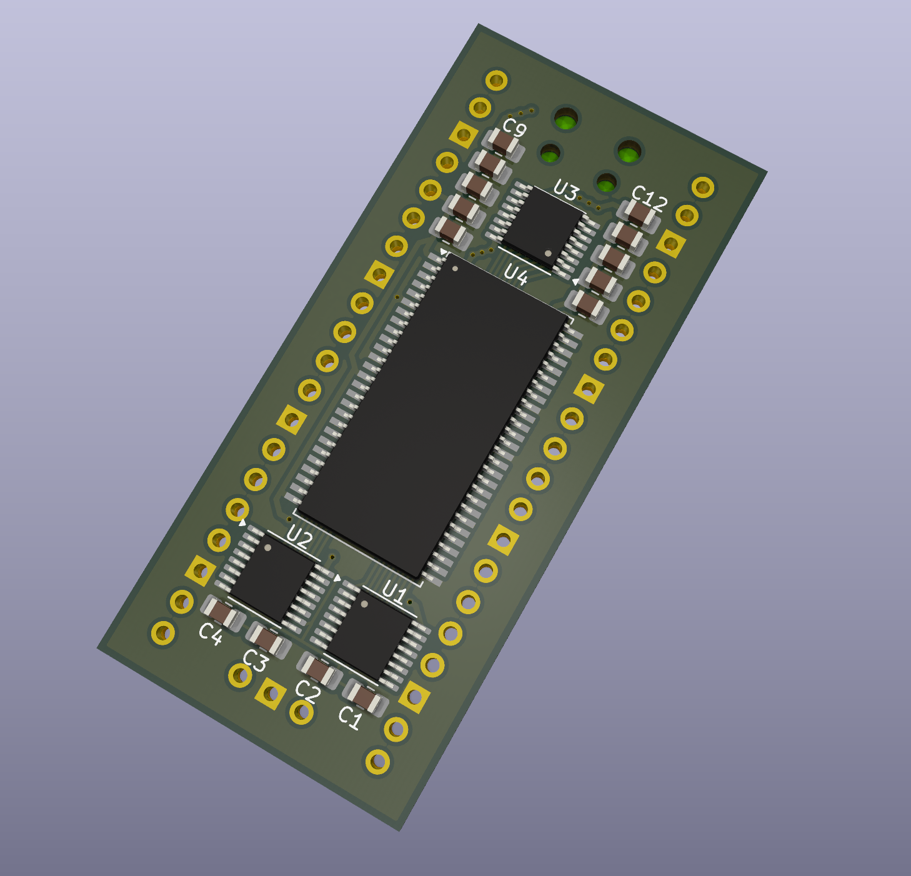
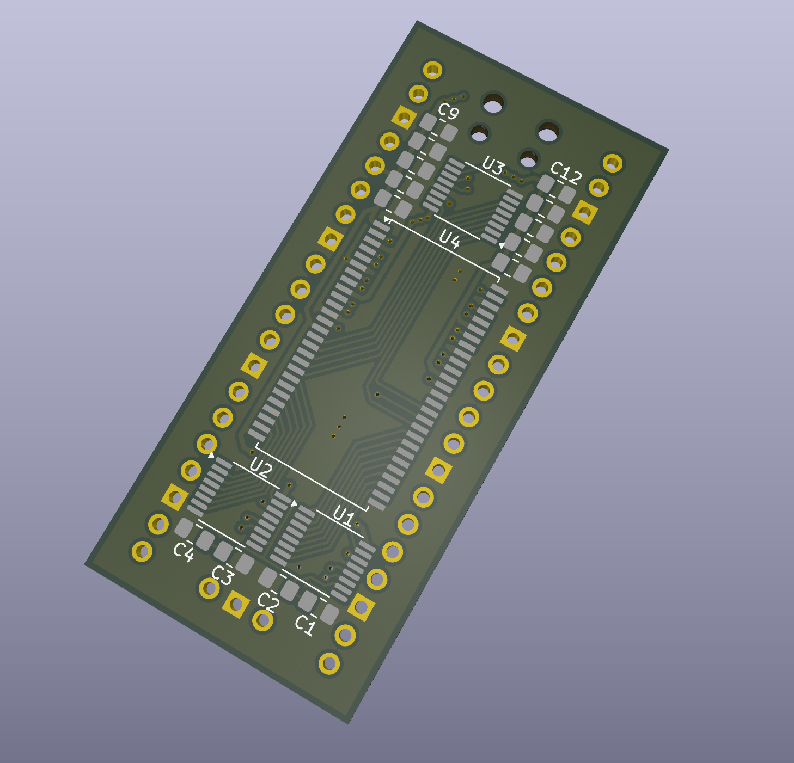
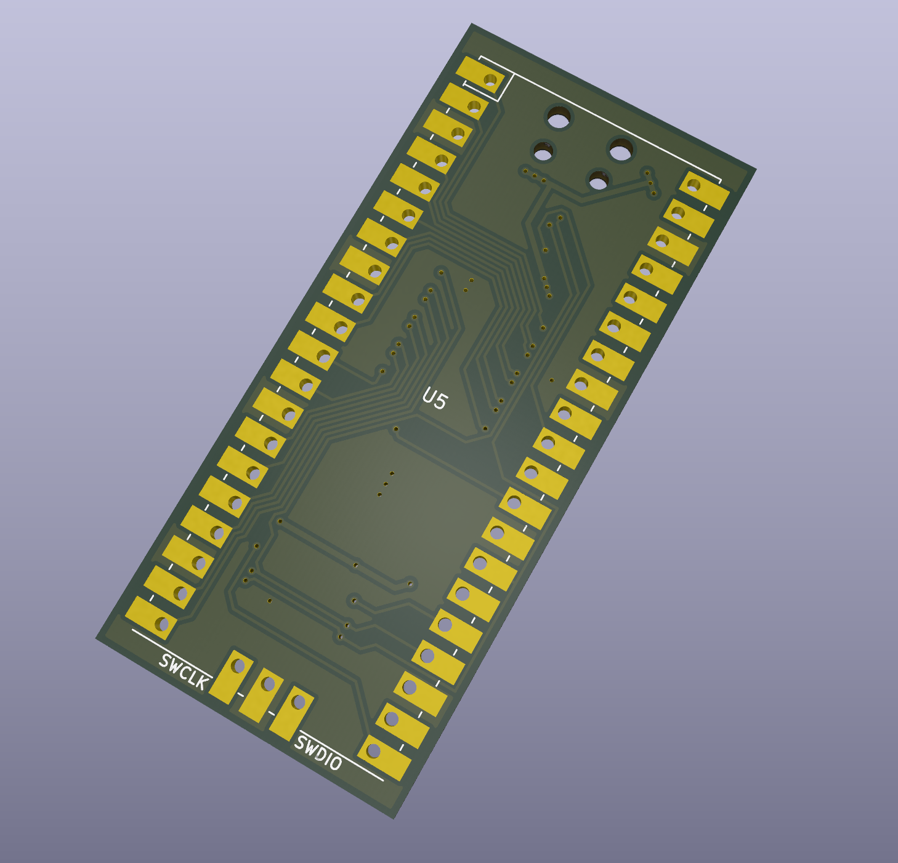

# pico-sdram

This project attempts to interface a Raspberry Pi Pico with a [32MB SDRAM IC](https://www.winbond.com/resource-files/w9825g6kh_a04.pdf).

<p>
  
   
  
  
</p>

## UPDATE - Current State
I have been able to successfully perform single and burst read/writes to the W9825G6KH SDRAM IC. I am running the SDRAM at half the speed of the rp2040 clock - the PIO state machines
are running at the minimum clock divider value.
I don't have full documentation, but some is available in:
* [pico/src/pico-sdram.c](pico/src/pico-sdram.c) - contains the main driver code
* [pico/src/pico-sdram.c](pico/src/pico-sdram.c) - example usage of the driver code
* [pico/src](pico/src)
* [pico/src/three_74hc595.pio](pico/src/three_74hc595.pio) - PIO driver for the 3x 74hc595 shift registers used to drive the address bus
* [pico/src/data_bus.pio](pico/src/data_bus.pio) - PIO driver for the 16-bit data bus

## Introduction
SDRAM ICs are commonly available in sizes of up to 256MBit (32MB), and most have either an 8-bit or 16-bit data bus width. The control interface uses a total of 23 pins, so there are simply too many pins for an RP2040 to directly drive using GPIOs. 

Shift registers may be reduce the number of GPIOs needed to interface with the ram. Because the RP2040 can only drive shift registers so quickly, the SDRAM chip would need to be driven at a lower clock speed. I propose a solution in which the control pins are driven using shift registers while the data bus is connected directly to the RP2040's GPIOs. This reduces the speed at which commands can be sent to the SDRAM, while still allowing the data bus to run at full speed. This solution has a drawback - it takes more time to send the two commands needed to initiate a read (row activate and read). However, this issue becomes neglible when most reads and writes use large block sizes (for example, when performing 1KB block reads and writes).

## Future Work
Eventually, I'd like to use this SDRAM interface with a PIO-based QSPI interface. The QSPI interface may then appear as a QSPI PSRAM and can be connected to the rp2350's QSPI bus. The pico can then translate "psram" accesses to sdram accesses, which would **allow the pico to natively access sdram in the address space**. This might not be possible.

## Digilent Waveforms SDRAM Protocol Decoder
```js
// rgData: input, raw digital data array
// rgValue: output, decoded data array
// rgFlag: output, decoded flag array

c = rgData.length

for(var i = 0; i < c; i++){
   // take 4 least significant bits
   rgValue[i] = rgData[i] & 0xFF;
   // set flag other than zero for valid data
   rgFlag[i] = 1;
}

// value: value sample
// flag: flag sample
function Value2Text(flag, value) {
  var lower = value & 0xf;
  var addr10 = ((value >> 7) & 1) > 0;
  if (lower & 1) return "";
  if (lower == 14) return "NOP";
  if (lower == 6) return "BURST_TERM";
  if (lower == 10) return addr10 ? "READ_PRECHARGE" : "READ";
  if (lower == 2) return addr10 ? "WRITE_PRECHARGE" : "WRITE";
  if (lower == 12) return "ACTIVATE";
  if (lower == 4) return "PRECHARGE";
  if (lower == 8) return "AUTO_REFRESH";
  if (lower == 0) return "LOAD_MODE";
  return "X";
}
Value2Text(0,0x82)

function Value2Text(flag, value) {
  var lower = value & 0xf;
  var addr10 = ((value >> 7) & 1) > 0;
  if (lower & 1) return "";
  if (lower == 14) return "NOP";
  if (lower == 6) return "BURST_T";
  if (lower == 10) return addr10 ? "READ_P" : "READ";
  if (lower == 2) return addr10 ? "WRITE_P" : "WRITE";
  if (lower == 12) return "ACTIVATE";
  if (lower == 4) return "PRCHG";
  if (lower == 8) return "A_RFRSH";
  if (lower == 0) return "MODE";
  return "X";
}
```
